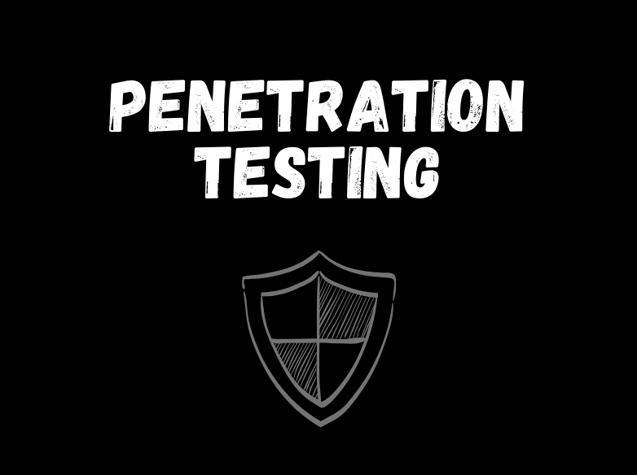

<html lang="en">
<head>
    <meta charset="UTF-8">
    <meta name="viewport" content="width=device-width, initial-scale=1.0">
    <title>Vincent Chimaobi | CyberGhoxt</title>
    
</head>
<body>
    <header class="header">
        <h1 style="
        display: inline-block;
        overflow: hidden;
        border-right: .15em solid rgb(255, 165, 0); /* Orange caret */
        white-space: nowrap;
        margin: 0 auto;
        letter-spacing: .15em;
        animation: typing 4s steps(40, end) infinite, blink-caret .75s step-end infinite;
        font-weight: bold;
        color: rgb(255, 0, 0); /* RGB red color */
        font-family: 'Helvetica Neue', Helvetica, sans-serif;
    ">
        Vincent Chimaobi's Portfolio.
    </h1>
        <nav class="nav">
        </nav>
    </header>
    <section id="about" class="section">
        <h2 style="color: #6E0A07;">About Me</h2>
        

            <a href="aboutme.md">
                
                
About Me

            </a>
        

    </section>
    <section id="OverTheWire Bandit Challenges" class="section">
        <h1 style="text-align: center">REAL-WORLD PROJECTS</h1>
        <h2 style="color: #A9A9A9">OVERTHEWIRE - BANDIT CHALLENGES. </h2>
        

            <a href="#">
                
                
OTW - Bandit Challenges

            </a>
        

    </section>
    <section id="PYTHON Projects For Cybersecurity" class="section">
        <h2 style="color: blue">PYTHON PROJECTS FOR CYBERSECURITY.</h2>
        

            <a href="python_for_cyber">
                
                
Python Projects for Cybersecurity 

            </a>
        

    </section>
    <section id="PYTHON Network Programming" class="section">
        <h2 style="color: #000080">PYTHON NETWORK PROGRAMMING. </h2>
        

            <a href="#">
                
                
Python - Network Programming 

            </a>
        

    </section>
    <section id="PYTHON ETHICAL SCRIPTING" class="section">
        <h2>PYTHON ETHICAL SCRIPTING. </h2>
        

            <a href="#">
                
                
Python Ethical Scripting

            </a>
        

    </section>
    <section id="PENETRATION TESTING" class="section">
        <h2>PENETRATION TESTING TOOLS APPLICATION. </h2>
        

            <a href="#">
                
                
PenTesting Tools Applications

            </a>
        

    </section>
    <section id="contact" class="section">
        <h2>Contact</h2>
        
<i>Connect with me on</i>

        

            <a href="https://github.com/VincentRitchie/CyberGhoxt">GitHub</a>
        

        

            <a href="https://www.linkedin.com/in/VincentRitchie/">LinkedIn</a>
        

        

            <a href="https://x.com/vin_chimaobi042">X</a>
        

        

            <a href="https://medium.com/vin_chimaobi042">Medium</a>
        

    </section>
    <footer style="text-align: center; padding: 1rem 0; background: #333; color: #fff;">
        
&copy; 2024 Vincent Chimaobi. All rights reserved.

    </footer>
</body>
</html>
