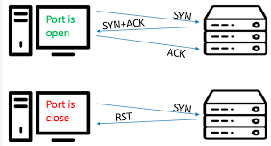

<section id="projects" class="section">
    <h1>Projects</h1>
    <h3>Basic Vulnerability Scanner</h3>
    

        <a href="https://github.com/VincentRitchie/Basic-Vulnerability-Scanner">
            
            
Simple Vulnerability Scanner

        </a>
    

    <h3>Basic Port Scanner</h3>
    

        <a href="https://github.com/VincentRitchie/Basic-Port-Scanner">
            
            
Simple Port Scanner

        </a>
    

</section>
